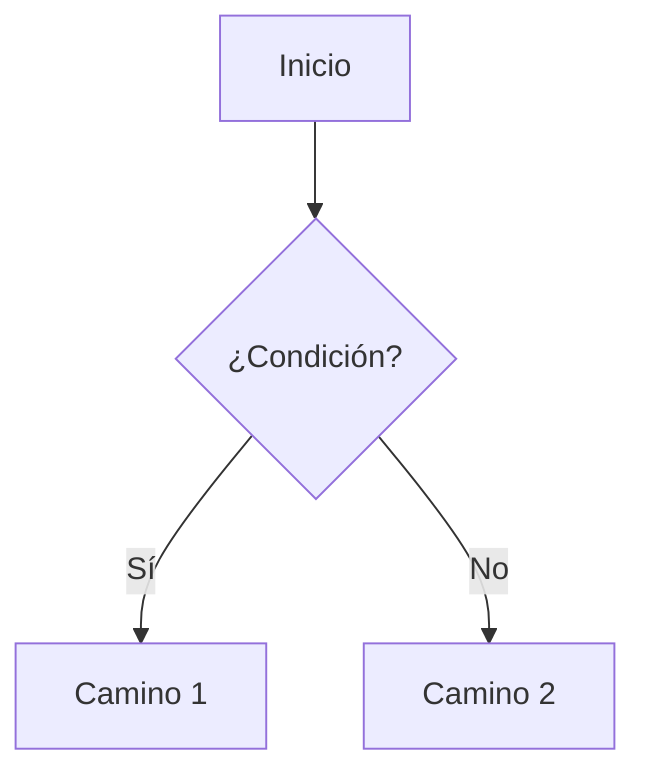

## Segundo Blog Post - First Header

Esto es un intento de hacer un segundo post en la web

---

### Probemos Mermaid de Markdown



### Y aqui probamos otro codigo

Esto es para ver info sobre quien eres e identificae qué proceso está asociado a cada sesión:
```bash
who -u
ps -t pts/0
```
Esto te mostrará los procesos ejecutándose en esa terminal. El primero de "ps -t pts/0" (generalmente el shell, como bash) es el que quieres matar.
